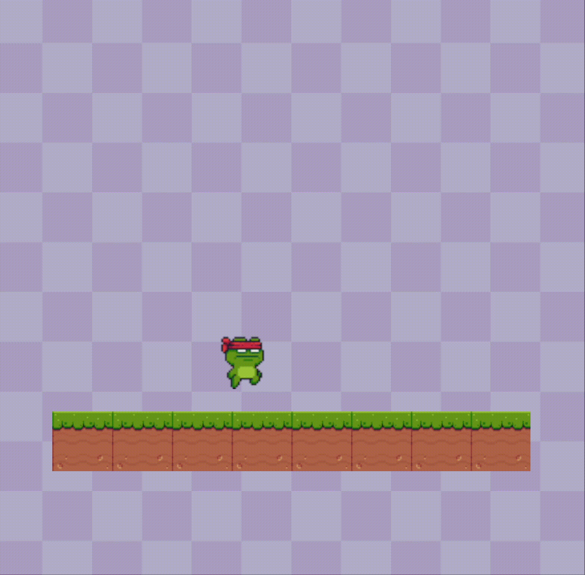

# Simple platformer

While there are some games out there that use only simple shapes, most games use images and textures to represent a more elaborate character than a triangle. So in this example we'll go through how FRUG can help us make games that have images and animations. What we'll do will look a bit like the following:



As you can see, there are no enemies or complex mechanics, but the basics are all there: we have animations of our frog, a background, and collisions. Some things might not be as polished as one might like but the idea is there and I thought it would be better to keep things as simple as possible.

We'll start with our basic FRUG setup we've used in previous examples in our `main.rs`:

```rust
use frug;

fn main() {
    let (frug_instance, event_loop) = frug::new("My Simple Platformer");

    let update_function = move |instance: &mut frug::FrugInstance, _input: &frug::InputHelper| {
       
    };

    frug_instance.run(event_loop, update_function);
}
```

Let's work our way up from the simple things to the complex ones, shall we? In such a case we'll start with drawing the background. For this we'll first need to load our texture, just as we did in previous examples:

> You can find all the assets for this project in the example folder of the FRUG repo in [this link](https://github.com/santyarellano/frug/tree/master/examples).

```rust
// background
let img_bytes = include_bytes!("platformer_imgs/Purple.png");
let background_tex_idx = frug_instance.load_texture(img_bytes);
```

I'm using the purple tiles you saw in the .gif above. However, the image is only 1/6th of what you saw. To achieve the background you saw we need to repeat the image a couple of times, for this we'll have the following function.

```rust
/// This function helps us draw the same texture for our background on repeat.
fn draw_repeat_background(instance: &mut frug::FrugInstance, tex_idx: usize, rows: u16, cols: u16) {
    let tile_w: f32 = 2.0 / cols as f32;
    let tile_h: f32 = 2.0 / rows as f32;
    for i in 0..rows {
        for j in 0..cols {
            instance.add_tex_rect(
                tile_w * j as f32 - 1.0,
                tile_h * -(i as f32) + 1.0,
                tile_w,
                tile_h,
                tex_idx,
                false,
                false,
            );
        }
    }
}
```

As you can see, our function receives a `FrugInstance` which we'll use to draw the texture rectangles for our mosaic background, we'll also receive the texture index of the image to draw, and how many columns and rows we want tod draw. With that all we need to do is calculate the length and height of each tile and draw them in their respective positions.

> Remember that FRUG uses a -1 to 1 coordinate system, which means the size of each size of the screen is 2. Yet these are world coordinates, and that means that if you use a non-squared screen you'll need to do some math to get proper proportions for your assets.

In this example we'll set our window to a squared size to avoid doing weird math to avoid weird stretched images.

```rust
frug_instance.set_window_size(800.0, 800.0);
```

Now all we have to do is call our function in our render section of our main:

```rust
// REMEMBER: THIS GOES AFTER THE instance.clear()

// background
draw_repeat_background(instance, background_tex_idx, 6, 6);
```

Now we should have our background being rendered nicely!

Next up, let's try drawing our floor tiles. For this we'll start by defining where this tiles will be in our "world". In future iterations we might need to change where things are to test different things, and to achieve this we'll create a matrix to "define" where things spawn in our world.

```rust
let world_matrix = [
    [0, 0, 0, 0, 0, 0, 0, 0, 0, 0],
    [0, 0, 0, 0, 0, 0, 0, 0, 0, 0],
    [0, 0, 0, 0, 0, 0, 0, 0, 0, 0],
    [0, 0, 0, 0, 0, 0, 0, 0, 0, 0],
    [0, 0, 0, 0, 0, 0, 0, 0, 0, 0],
    [0, 0, 0, 0, 0, 0, 0, 0, 0, 0],
    [0, 0, 0, 0, 0, 0, 0, 0, 0, 0],
    [0, 1, 1, 1, 1, 1, 1, 1, 1, 0],
    [0, 0, 0, 0, 0, 0, 0, 0, 0, 0],
    [0, 0, 0, 0, 0, 0, 0, 0, 0, 0],
];
```

As you can see, we have a 10x10 matrix of 0s and 1s. In here 0s mean nothing, but the 1s will represent these floor tiles.

Now we'll need to define our struct to represent our game objects.

```rust
#[derive(Clone)]
struct Entity {
    _name: Option<String>,
    tex_idx: Option<usize>,
    sprite: Option<Sprite>,
    pos: Option<Vector2<f32>>,
    vel: Option<Vector2<f32>>,
    size: Option<Vector2<f32>>,
    collisions: bool,
    gravity: bool,
    controlling: bool,
    flip_img_x: bool,
    flip_img_y: bool,
}
```

> You'll notice that there are a lot of attributes in that struct that we don't really need for the floor tiles. However, you'll see later on that they will come in handy, yet some of this can be a bit obvious what they do. 

If you're using some code editor that checks how things are going you'll find out that there is a data type that doesn't exist, something called `Sprite`. We'll also need to define this struct, which will be used with our player to handle our animations.

```rust
#[derive(Clone)]
struct Sprite {
    tex_idxs: Vec<usize>,
    anim_speed: u8,
    frame_timer: u8,
    current_idx: usize,
}
```

Now, we'll need to to create some methods for our `Entity`, the first of these is the default implementation. This is just to ease our future a bit when we create new instances of our entity object.

```rust
impl Default for Entity {
    fn default() -> Self {
        Entity {
            _name: None,
            tex_idx: None,
            sprite: None,
            pos: None,
            vel: None,
            size: None,
            collisions: false,
            gravity: false,
            controlling: false,
            flip_img_x: false,
            flip_img_y: false,
        }
    }
}
```

And we'll also need the render method of our entities.

```rust
impl Entity {
    fn render(&self, frug_instance: &mut FrugInstance) {
        match self.tex_idx {
            Some(idx) => frug_instance.add_tex_rect(
                self.pos.unwrap().x,
                self.pos.unwrap().y,
                self.size.unwrap().x,
                self.size.unwrap().y,
                idx,
                self.flip_img_x,
                self.flip_img_y,
            ),
            None => {}
        }
    }
}
```

With this, we won't have to worry about how we draw every type of game object. We just have to create entities and give them the proper texture index.

Yet for this to work properly we need to create a `Vec` of entities to hold all our entities and make it easy to call all methods for all our entities (this goes before our update function in our main).

```rust
let mut entities: Vec<Entity> = Vec::new();
```

Before we can create those instances we should load the texture for our floor tiles (just after we loaded the background texture).

```rust
// floor tiles
let img_bytes = include_bytes!("platformer_imgs/land.png");
let land_tex_idx = frug_instance.load_texture(img_bytes);
```

And now we actually need to create those entities. We'll go through our `world_matrix` and create a floor tile when we encounter a 1.

```rust
// load entities according to world matrix
for i in 0..world_matrix.len() {
    for j in 0..world_matrix[0].len() {
        match world_matrix[i][j] {
            1 => {
                // floor tiles
                let land_size = 2.0 / world_matrix.len() as f32;
                let land_pos_x = j as f32 * land_size - 1.0;
                let land_pos_y = i as f32 * -land_size + 1.0;
                let new_land = Entity {
                    tex_idx: Some(land_tex_idx),
                    pos: Some(Vector2 {
                        x: land_pos_x,
                        y: land_pos_y,
                    }),
                    size: Some(Vector2 {
                        x: land_size,
                        y: land_size,
                    }),
                    collisions: true,
                    ..Default::default()
                };

                entities.push(new_land);
            }
            _ => {}
        }
    }
}
```

As you can see that bit of code is somewhat longer than other blocks of code, but I hope it is easy enought to understand. All we do is if we find a 1 in the world matrix we calculate where our floor tiles should be and create an entity instance with such values and the proper texture index.

No we just have to call our `render` method in our rendering section of our main function (after we draw our background).

```rust
// entities
for entity in &entities {
    entity.render(instance);
}
```

If you run this, you should be able to see your tiles neatly rendering in that world! And the better part of this is that you can modify the world matrix and you'll have to change nothing more for the changes to appear in your game!

Now, the last part, and the longest one is our player. This will involve some changes but hopefully it will be easy enough with what we've done so far.

We can start with loading the textures for our player, in this case, a frog (but feel free to use whatever you want). For this we'll store them in a `vec!` instead. This is because we'll have multiple images for our animation of our frog.

```rust
// frog
let frog_tex_idxs = vec![
    frug_instance.load_texture(include_bytes!("platformer_imgs/frog/0.png")),
    frug_instance.load_texture(include_bytes!("platformer_imgs/frog/1.png")),
    frug_instance.load_texture(include_bytes!("platformer_imgs/frog/2.png")),
    frug_instance.load_texture(include_bytes!("platformer_imgs/frog/3.png")),
    frug_instance.load_texture(include_bytes!("platformer_imgs/frog/Fall.png")),
    frug_instance.load_texture(include_bytes!("platformer_imgs/frog/Jump.png")),
];
```

> As you can see we have 4 images (which will be for our walking animation), 1 for our jump, and 1 for when the player is falling.

For the sake of keeping this tutorial short I'll go a bit quicker with the next steps. For these next sections I'll just make a summary of what is happening, but I'll try to make the code as understandable as possible.

Before starting with that we'll create some constants (this will go at the beggining of our file just after our imports).

```rust
// ======= CONSTANTS & ENUMS ======
const GRAVITY: f32 = 0.001;
const PLAYER_SPEED: f32 = 0.01;
const PLAYER_JUMP: f32 = 0.02;

enum Collision {
    Top,
    Bottom,
    Left,
    Right,
    None,
}
// ======= CONSTANTS & ENUMS ======
```

We'll need to add some methods to our `Entity`:

```rust
impl Entity {
    fn process_input(&mut self, input: &frug::InputHelper) {
        if self.controlling {
            match self.vel.as_mut() {
                Some(vel) => {
                    vel.x = 0.0;
                    if input.key_held(frug::VirtualKeyCode::Left) {
                        vel.x -= PLAYER_SPEED;
                    }

                    if input.key_held(frug::VirtualKeyCode::Right) {
                        vel.x += PLAYER_SPEED;
                    }

                    if input.key_pressed(frug::VirtualKeyCode::Space) {
                        if vel.y == 0.0 {
                            vel.y += PLAYER_JUMP;
                        }
                    }
                }
                None => {}
            }
        }
    }

    fn update(&mut self, all_entities: &[Entity], current_idx: usize) {
        // gravity
        if self.gravity {
            self.vel.as_mut().unwrap().y -= GRAVITY;
        }

        // collisions
        if self.collisions {
            for i in 0..all_entities.len() {
                if i != current_idx {
                    // only collide if other object has collisions as well
                    if all_entities[i].collisions {
                        match self.check_collision(&all_entities[i]) {
                            Collision::Top => match self.vel.as_mut() {
                                Some(v) => {
                                    if v.y > 0.0 {
                                        v.y = 0.0;
                                    }
                                }
                                None => {}
                            },
                            Collision::Bottom => match self.vel.as_mut() {
                                Some(v) => {
                                    //println!("{}", v.y);
                                    if v.y < 0.0 {
                                        v.y = 0.0;
                                    }
                                }
                                None => {}
                            },
                            Collision::Left => match self.vel.as_mut() {
                                Some(v) => {
                                    if v.x < 0.0 {
                                        v.x = 0.0;
                                    }
                                }
                                None => {}
                            },
                            Collision::Right => match self.vel.as_mut() {
                                Some(v) => {
                                    if v.x > 0.0 {
                                        v.x = 0.0;
                                    }
                                }
                                None => {}
                            },
                            Collision::None => {}
                        }
                    }
                }
            }
        }

        // movement
        match self.vel {
            Some(v) => {
                let pos = self.pos.unwrap();
                self.pos = Some(pos + v);
            }
            None => {}
        }

        // animate
        self.animate();
    }

    fn render(&self, frug_instance: &mut FrugInstance) {
        match self.tex_idx {
            Some(idx) => frug_instance.add_tex_rect(
                self.pos.unwrap().x,
                self.pos.unwrap().y,
                self.size.unwrap().x,
                self.size.unwrap().y,
                idx,
                self.flip_img_x,
                self.flip_img_y,
            ),
            None => {}
        }
    }

    // choose the correct texture index accordingly
    fn animate(&mut self) {
        // animate only if object has sprites
        match self.sprite.as_mut() {
            Some(sprite) => {
                match &self._name {
                    // Define how the animations work for each name
                    Some(name) => match name.as_str() {
                        "Player" => {
                            match &self.vel {
                                Some(vel) => {
                                    // flip img if necessary
                                    if vel.x > 0.0 {
                                        self.flip_img_x = false;
                                    } else if vel.x < 0.0 {
                                        self.flip_img_x = true;
                                    }

                                    // jump/fall (has priority)
                                    if vel.y > 0.0 {
                                        sprite.current_idx = 5;
                                    } else if vel.y < 0.0 {
                                        sprite.current_idx = 4;
                                    }
                                    // walk
                                    else if vel.x != 0.0 {
                                        // update timer
                                        if sprite.frame_timer == 0 {
                                            // timer ended
                                            sprite.frame_timer = sprite.anim_speed;
                                            sprite.current_idx += 1;
                                            if sprite.current_idx > 3 {
                                                // animation must go back to beggining
                                                sprite.current_idx = 0;
                                            }
                                        }
                                        sprite.frame_timer -= 1;
                                    }
                                    // idle
                                    else {
                                        sprite.frame_timer = 0;
                                        sprite.current_idx = 0;
                                    }
                                }
                                None => {}
                            }

                            // update texture index
                            self.tex_idx = Some(sprite.tex_idxs[sprite.current_idx]);
                        }
                        _ => {}
                    },
                    None => {}
                }
            }
            None => {}
        }
    }

    // checks collision with another entity
    fn check_collision(&self, other: &Entity) -> Collision {
        let collision_room = self.size.unwrap() / (2.0 * 3.0) / 2.0;

        // self collision borders
        let s_horizontal = (
            self.get_center().x - collision_room.x, // left
            self.get_center().x + collision_room.x, // right
        );
        let s_vertical = (
            self.get_center().y + collision_room.y, // top
            self.get_center().y - collision_room.y, // bottom
        );

        // other collision borders
        let o_horizontal = (
            other.pos.unwrap().x,                         // left
            other.pos.unwrap().x + other.size.unwrap().x, // right
        );
        let o_vertical = (
            other.pos.unwrap().y,                         // top
            other.pos.unwrap().y - other.size.unwrap().y, // bottom
        );

        // check for vertical collisions
        if (s_horizontal.0 > o_horizontal.0 && s_horizontal.0 < o_horizontal.1)
            || (s_horizontal.1 > o_horizontal.0 && s_horizontal.1 < o_horizontal.1)
        {
            // self is within the horizontal range of other

            // check for top collision
            if self.pos.unwrap().y >= o_vertical.1 && self.pos.unwrap().y <= o_vertical.0 {
                return Collision::Top;
            }
            // check for bottom collision
            else if self.pos.unwrap().y - self.size.unwrap().y <= o_vertical.0
                && self.pos.unwrap().y - self.size.unwrap().y >= o_vertical.1
            {
                return Collision::Bottom;
            }
        }

        // check for horizontal collisions
        if (s_vertical.0 < o_vertical.0 && s_vertical.0 > o_vertical.1)
            || (s_vertical.1 < o_vertical.0 && s_vertical.1 > o_vertical.1)
        {
            // self is within the vertical range of other

            // check for left collision
            if self.pos.unwrap().x < o_horizontal.1 && self.pos.unwrap().x > o_horizontal.0 {
                return Collision::Left;
            }

            // check for right collision
            if self.pos.unwrap().x + self.size.unwrap().x > o_horizontal.0
                && self.pos.unwrap().x + self.size.unwrap().x < o_horizontal.1
            {
                return Collision::Right;
            }
        }

        return Collision::None;
    }

    fn get_center(&self) -> Vector2<f32> {
        return Vector2 {
            x: self.pos.unwrap().x + self.size.unwrap().x / 2.0,
            y: self.pos.unwrap().y - self.size.unwrap().y / 2.0,
        };
    }
}
```

* the `process_input` receives the frug::InputHelper and acts if the entity has enabled the `controlling` field and add to the player's velocity (x) the player speed constant we just defined when the left/right arrows are being held, and when the space bar is being pressed we add to the player's velocity (y) the jump constant we created (only if the such velocity was 0, which will help us avoid an infinite jump bug).

* the `update` handles adding gravity to the velocity if such attribute is enabled for the entity, then handle collisions (this part is way too long to explain but it is a generic collision detection algorithm which allows to detect the direction where objects are colliding. This part also receives the `all_entities` parameter to compare against all entities). If collisions are happening, we modify the velocity of the entity to simulate real collisions. This part could be improved but for the sake of simplicity let's leave it at the least needed for it to work. We then update the entity's position based on the velocity. Finally we call the animate function.

* the `animate` function handles the selection of the correct texture index based on the object's name (this helps to define if it's the player or another type of entity), and the entity's velocity. Again, this could be better but this was a simple solution that works.

* the `check_collision` checks whether the entity is colliding against another entity and if so, return the direction it is colliding from.

* the `get_center` is a helper function that returns a vector2 indicating the center position of an entity.

After this modifications to our entity struct, we actually need to spawn our player. We'll use the number 2 to indicate that in the world matrix.

```rust
let world_matrix = [
    [0, 0, 0, 0, 0, 0, 0, 0, 0, 0],
    [0, 0, 0, 0, 0, 0, 0, 0, 0, 0],
    [0, 0, 0, 0, 0, 0, 0, 0, 0, 0],
    [0, 0, 0, 0, 0, 0, 0, 0, 0, 0],
    [0, 0, 0, 0, 0, 0, 0, 0, 0, 0],
    [0, 0, 2, 0, 0, 0, 0, 0, 0, 0],
    [0, 0, 0, 0, 0, 0, 0, 0, 0, 0],
    [0, 1, 1, 1, 1, 1, 1, 1, 1, 0],
    [0, 0, 0, 0, 0, 0, 0, 0, 0, 0],
    [0, 0, 0, 0, 0, 0, 0, 0, 0, 0],
];
```

And we'll need to add that case in our entities loading.

```rust
2 => {
    // player
    let size = 2.0 / world_matrix.len() as f32;
    let pos_x = j as f32 * size - 1.0;
    let pos_y = i as f32 * -size + 1.0;
    let new_player = Entity {
        _name: Some("Player".to_string()),
        tex_idx: None,
        sprite: Some(Sprite {
            tex_idxs: frog_tex_idxs.clone(),
            anim_speed: 8,
            frame_timer: 8,
            current_idx: 0,
        }),
        pos: Some(Vector2 { x: pos_x, y: pos_y }),
        size: Some(Vector2 { x: size, y: size }),
        vel: Some(Vector2 { x: 0.0, y: 0.0 }),
        collisions: true,
        gravity: true,
        controlling: true,
        ..Default::default()
    };

    entities.push(new_player);
}
```

As you can see, in this instance we're using the other attributes defined in our `Entity` struct. Thank you for your patience!

And lastly, we need to add some calls in our update function to actually process the input and call the update method of our entities.

```rust
// process input
for entity in entities.iter_mut() {
    entity.process_input(input)
}

// update
for i in 0..entities.len() {
    let mut current_entity = entities[i].clone();

    current_entity.update(&entities, i);
    entities[i] = current_entity;
}
```

And that's it! You should have your game ready to run!

In case something didn't work properly, feel free to review the full code in the example ([here's the link](https://github.com/santyarellano/frug/blob/master/examples/platformer.rs)).