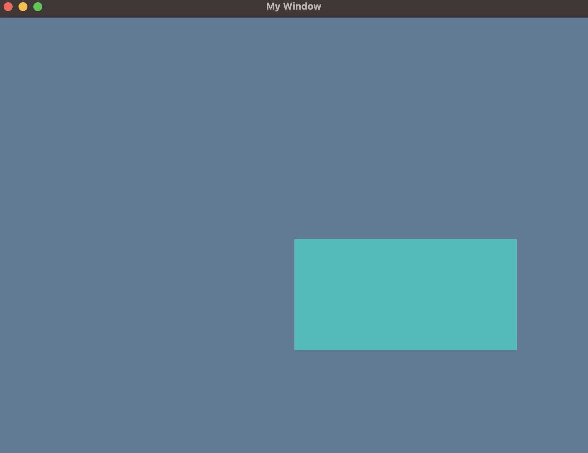

# Background color

Now, maybe we don't want just a black background for our games, maybe we want some blue for a sky, or green if we're in some type of forest. We can do this easily in our game, all we need to do is create the color we want and tell our FRUG instance that we should use that color instead.

We can start by creating a variable to hold that color we want before definind our update function (or in other words, right at the beggining of our main function).

```rust
let (frug_instance, event_loop) = frug::new("My Window");

let background_color = frug::create_color(0.1, 0.2, 0.3, 1.0); // <- NEW!
```

Now we just have to tell our `frug_instance` to use such color as the background color. Don't forget to make the `frug_instance` mutable so we can actually do that!

```rust
let (mut frug_instance, event_loop) = frug::new("My Window"); // make the instance mutable!

let background_color = frug::create_color(0.1, 0.2, 0.3, 1.0);
frug_instance.set_background_color(background_color); // <- NEW!
```

If you run this you should see our background in a new and nice blue!



The final code for this section should look something like this:

```rust
use frug;

fn main() {
    let (mut frug_instance, event_loop) = frug::new("My Window");

    let background_color = frug::create_color(0.1, 0.2, 0.3, 1.0);
    frug_instance.set_background_color(background_color);

    let update_function = move |instance: &mut frug::FrugInstance, _input: &frug::InputHelper| {
        instance.clear();
        instance.add_colored_rect(0.0, 0.0, 0.75, 0.5, [0.0, 0.5, 0.5]);
        instance.update_buffers();
    };

    frug_instance.run(event_loop, update_function);
}

```

In the next section we'll start drawing images using textures!