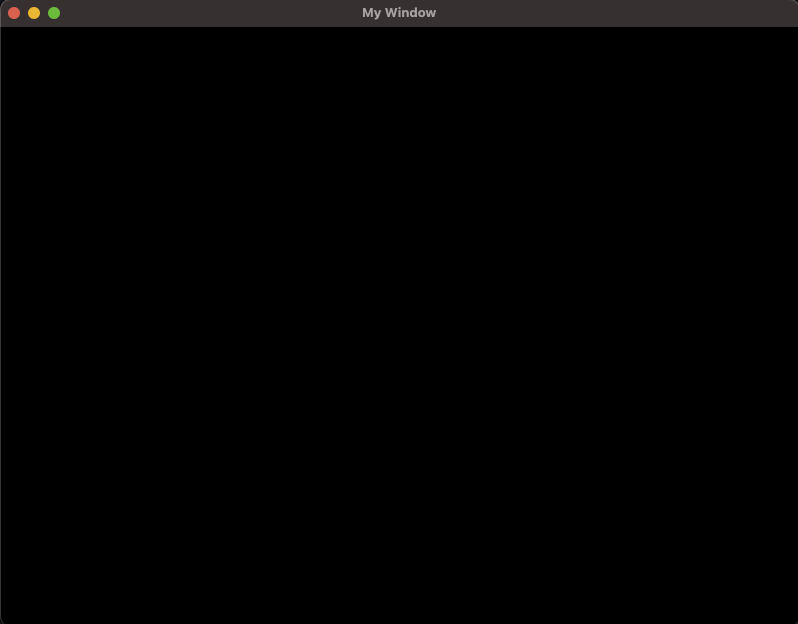

# Setup and creating a window

We can't do much related to getting things on the screen if we don't have somewhere to draw our stuff in the first place, so we'll need to create a window for that. 

As with most rust projects, we'll need to start creating our new project with the following command:

```
cargo init my_frug_project
```

FRUG attempts to simplify the process of starting out, and that includes importing stuff. All we'll need for now is adding FRUG into our **Cargo.toml**:

```toml
# ...

[dependencies]
frug = "0.1.0" 
# We'll use the star to use the latest version. 
# If you want, you can substitute the star with the version number you want to use.
```

Now that frug is in our project we can start using it in our main. For this, add the import of frug into the top of your `main.rs`:

```rust
use frug;
```

Now, inside our main function we'll need to add some things in order for the magic to happen, the first of these is the `frug_instance` which is the object that holds most of our functions and setup of our window, camera, textures, etc. The other one is the event_loop (we will not go into much detail for the moment about this, just keep in mind that it is where things will happen). Fortunately all we need to get these two things is call a function called `new` which returns both things. All we need to pass as a parameter is the name we want for our window. In the end it looks like this inside our `main` function.

```rust
let (frug_instance, event_loop) = frug::new("My Window");
```

Then, we'll need our update function, which we won't use for the moment but it is important because it is here where we will write the code we want to execute with each frame.

```rust
let update_function = move |_instance: &mut frug::FrugInstance, _input: &frug::InputHelper| {
    // your frame per frame code will go here!
};
```

Lastly, all we need to do is start running our game. For this, the `frug_instance` has a method called `run` which receives the event loop we initialized earlier, and the code we want to execute each frame (the update function).

```rust
frug_instance.run(event_loop, update_function);
```

In the end, your whole `main.rs` file should look like this:

```rust
use frug;

fn main() {
    let (frug_instance, event_loop) = frug::new("My Window");

    let update_function = move |_instance: &mut frug::FrugInstance, _input: &frug::InputHelper| {
        // your frame per frame code will go here!
    };

    frug_instance.run(event_loop, update_function);
}
```

And if you run it with `cargo run` it should give you a window that looks like this:



> You might notice that a bunch of errors are showing up in our terminal. This happens because we're not asking WGPU (the graphics API behind FRUG) to do anything. We can ignore this for the moment as we'll start doing just that when we start drawing rectangles and shapes on our window. With time I'll fix that issue but for the moment you can be at peace knowing that those errors will dissapear in time.

Next stop... drawing rectangles!