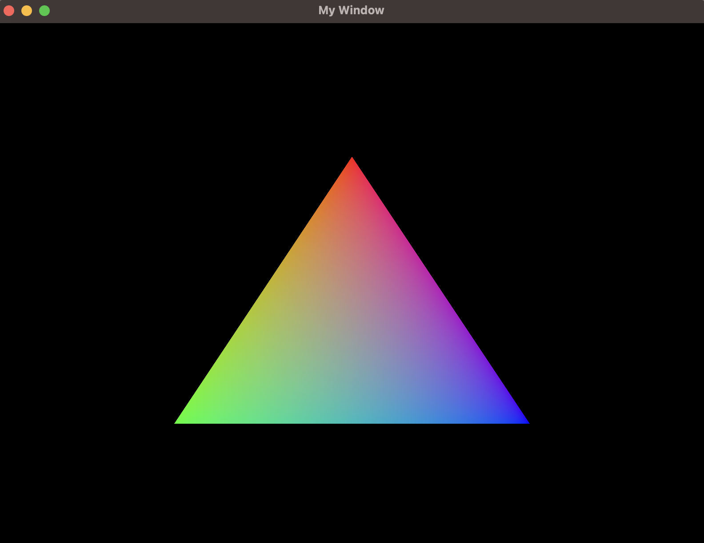

# Creating a custom shape

Some times we want to use use other shapes different than rectangles. In this case FRUG gives us some flexibility and allows us to work at a bit lower level but still with simplicity. As you might already know, drawing things on the screen is mainly done via traingles, and our library is no exception.

Now, do you remember in the rectangle section that we mentioned that FRUG works by storing a list (actually a `vec`) of all the shapes we want to draw? Well, the FRUG instance has a function called `add_colored_vertices` which receives a set of vertices and indices to create a shape and add it to the staging buffer. For this we'll need to use another struct FRUG provides called `Vertex` which is composed of the position of the vertex, the color, and a texture index.

> For the moment we'll ignore the texture index property of our vertex struct, but keep in mind that in the future we'll be able to do something similar to this but with images!

Let's start by cleaning up our `main.rs` so we have the bare minimum to create our window.

```rust
use frug;

fn main() {
    let (mut frug_instance, event_loop) = frug::new("My Window");

    let update_function = move |instance: &mut frug::FrugInstance, _input: &frug::InputHelper| {
        // Rendering
        instance.clear();
        instance.update_buffers();
    };

    frug_instance.run(event_loop, update_function);
}
```

Now that we have a clean slate we can start to define things one by one. Let's start with the color of our vertices, shall we? We want to create something a bit colorful, so let's create 3 colors before our update function (I'll keep it simple and make one pure red, another green, and another blue. But feel free to do it with your own colors!).

```rust
let red = [1.0, 0.0, 0.0];
let green = [0.0, 1.0, 0.0];
let blue = [0.0, 0.0, 1.0];
```

Now that we have our colors, lets define our vertices. For this we'll only give the position and the color, the rest we'll leave at default.

```rust
let vertices = [
    frug::Vertex {
        // Vertex 0
        position: [0.0, 0.5, 0.0],
        color: red,
        ..Default::default()
    },
    frug::Vertex {
        // Vertex 1
        position: [-0.5, -0.5, 0.0],
        color: green,
        ..Default::default()
    },
    frug::Vertex {
        // Vertex 2
        position: [0.5, -0.5, 0.0],
        color: blue,
        ..Default::default()
    },
];
```

Then we need to define which indices we want to use. In this case we're drawing a triangle and we only need 3 indices, but you could be using a figure with more vertices (in such cases you should know that the indices represent which vertices form which triangles, this should be specified in counter clockwise order). 

```rust
let indices = [0, 1, 2];
```

Lastly, all we need is to tell rust to draw our triangle using those vertices and indices. Let's add that line after our `instance.clear()`.

```rust
instance.add_colored_vertices(&vertices, &indices);
```

If you run your project you should see our multi-colored triangle.



The `main.rs` file should look like this:

```rust
use frug;

fn main() {
    let (frug_instance, event_loop) = frug::new("My Window");

    let red = [1.0, 0.0, 0.0];
    let green = [0.0, 1.0, 0.0];
    let blue = [0.0, 0.0, 1.0];

    let vertices = [
        frug::Vertex {
            // Vertex 0
            position: [0.0, 0.5, 0.0],
            color: red,
            ..Default::default()
        },
        frug::Vertex {
            // Vertex 1
            position: [-0.5, -0.5, 0.0],
            color: green,
            ..Default::default()
        },
        frug::Vertex {
            // Vertex 2
            position: [0.5, -0.5, 0.0],
            color: blue,
            ..Default::default()
        },
    ];

    let indices = [0, 1, 2];

    let update_function = move |instance: &mut frug::FrugInstance, _input: &frug::InputHelper| {
        // Rendering
        instance.clear();
        instance.add_colored_vertices(&vertices, &indices);
        instance.update_buffers();
    };

    frug_instance.run(event_loop, update_function);
}
```

As for version 0.1.0 (the first public version) these will be all the guides. However, I'll leave some examples to show how one could make a simple pong game and a platformer. Feel free to check those out or make your own!