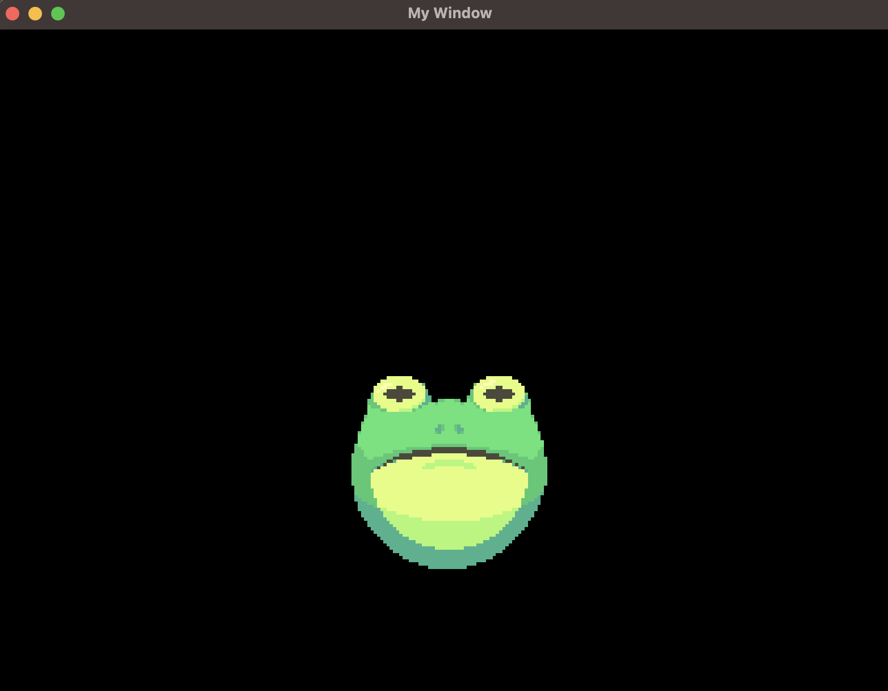

# Drawing a texture

Drawing rectangles is all fine and we could technically make games with just that (like Pong! as we'll see in the examples) but most games use images to represent our characters. To keep things simple in this guide we'll just draw an image on the screen, but we'll see how to make more interesting things with this in the (simple) platformer example.

As we won't need all the previous stuff we did let's first clean up our file so we are with a clean window with a dark background (if you want you can use another color though, you now know how!).

We should have something like this:

```rust
extern crate frug;

fn main() {
    let (mut frug_instance, event_loop) = frug::new("My Window");

    let update_function = move |instance: &mut frug::FrugInstance, _input: &frug::InputHelper| {
        instance.clear();

        instance.update_buffers();
    };

    frug_instance.run(event_loop, update_function);
}
```

Now, to draw things on the screen we first need to load those resources. FRUG receives the bytes of such images so they can be embedded in our game and we don't need to ship our game with a bunch of folders containing such images (yet you can do that if you want!). To do this we'll use rust's `include_bytes` function before defining our update function. I'll use an image of a frog I have but feel free to use any image you like.

```rust
let img_bytes = include_bytes!("frog.png");
```

Then we need to tell our FRUG instance to load those bytes.

```rust
let frog_text_idx = frug_instance.load_texture(img_bytes);
```

> FRUG helps us out a bit by returning the index of such texture so we can use it later. For the moment it might not make much sense but it will in a bit.

Now all we need to do is inside our update function after the `instance.clear()` tell our instance to draw a rectangle using the texture we just loaded. We use the following line:

```rust
instance.add_tex_rect(-0.25, 0.0, 0.5, 0.5, frog_text_idx);
```

You might notice that such function looks very similar to the one we used to draw colored rectangles, the only difference is that instead of passing a color we pass the index of our texture, which we stored before while loading our texture.

If you run the project you should be able to see your image on the screen!



Your whole `main.rs` should look like this:

```rust
use frug;

fn main() {
    let (mut frug_instance, event_loop) = frug::new("My Window");

    let img_bytes = include_bytes!("frog.png");
    let frog_text_idx = frug_instance.load_texture(img_bytes);

    let update_function = move |instance: &mut frug::FrugInstance, _input: &frug::InputHelper| {
        instance.clear();

        instance.add_tex_rect(-0.25, 0.0, 0.5, 0.5, frog_text_idx);

        instance.update_buffers();
    };

    frug_instance.run(event_loop, update_function);
}
```

Now let's see how we can create custom shapes, shall we?