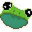

# Introduction 

Welcome to the FRUG documentation! Here you will find guides and examples to help you get started using FRUG.

FRUG is intended to provide a similar abstraction layer over graphics programming as to how SDL and SFML do for C/C++, meaning that it should provide developers enough control and flexibility to implement their own architectures & design patterns, yet simplifying the process of working with graphics so developers won’t have to worry about implementing all the repetitive tasks related to getting things to the screen.

The purpose of the project is to provide a simple graphics library which allows learning directly on rust (which is why documentation and tutorials for FRUG are vital) and developing simple games with as few resources/libraries as possible. 

> Please note that the project is still in **very** early stages of development, I would only advice to use it if you want to learn how to make simple games with rust. This may change in the future, yet for the moment the implemented features are minimal and things may change drastically.

Currently FRUG allows the following features:
- Window creation
- Loading & rendering textures
- Scaling textures
- Handle Mouse input
- Handle Keyboard input

And these are the features currently under development:
- Rotating textures
- Alpha blending for textures
- Choosing a specific backend (Direct X, Metal, Vulkan, etc.)
- Writing and using custom shaders
- Handle window state events
- Drawing text easily
- Playing audio
- Configure audio